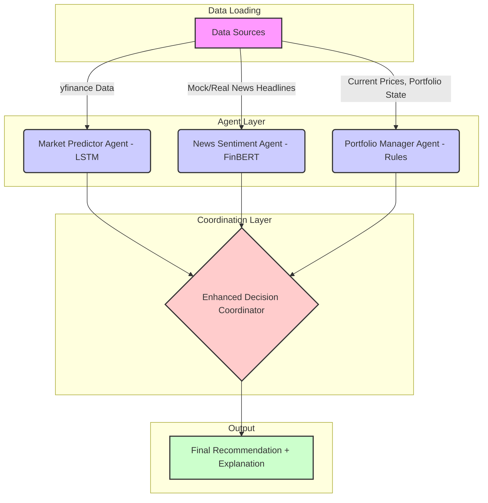

**Project Report: MAFDS - A Multi-Agent Financial Decision System**

**Author:** Pranav Tushar Pradhan\
**Date:** March 30, 2025

**Abstract**

The complexity and multi-faceted nature of financial markets demand sophisticated decision-support systems capable of integrating diverse information sources. This report details the design, implementation, and capabilities of MAFDS (Multi-Agent Financial Decision System), a modular system leveraging specialized agents for news sentiment analysis, market technical prediction, and portfolio management. Inspired by the paradigm of synergistic multi-agent collaboration seen in systems like FINCON (Zhang et al., 2024), MAFDS aims to provide transparent, explainable, and context-aware investment recommendations (Buy/Sell/Hold) for equity tickers. The system features a FinBERT-based News Sentiment Agent, an LSTM-based Market Predictor Agent, and a rule-based Portfolio Manager Agent grounded in Modern Portfolio Theory. Coordination is managed asynchronously via a central coordinator employing confidence-weighted voting and critical override rules. This report outlines the system architecture, agent methodologies, coordination strategy, example outputs, and potential avenues for future enhancement, including the integration of advanced reinforcement learning techniques.

**1. Introduction**

Financial decision-making is an inherently complex task, requiring the synthesis of quantitative market data, qualitative news sentiment, macroeconomic factors, and individual portfolio constraints. Traditional monolithic models often struggle to capture the nuances across these diverse domains. The multi-agent system (MAS) paradigm offers a compelling alternative, allowing specialized agents, each expert in a specific area, to collaborate towards a common goal (Wooldridge, 2009).

Recent advancements, such as the FINCON system (Zhang et al., 2024), demonstrate the potential of leveraging multiple agents, including Large Language Models (LLMs), to enhance financial decision-making through synergistic analysis and conceptual reasoning. While FINCON focuses heavily on LLM capabilities and synthesized verbal reinforcement, the core principle of utilizing specialized agents to tackle distinct facets of the financial landscape resonates strongly.

This project, MAFDS, embraces this multi-agent philosophy. It constructs a system comprising three distinct agents:

1.  **News Sentiment Agent:** Analyzes sentiment expressed in financial news headlines using natural language processing.
2.  **Market Predictor Agent:** Forecasts short-term market direction based on historical price patterns and technical indicators using a time-series model.
3.  **Portfolio Manager Agent:** Evaluates investment decisions within the context of the user's existing portfolio, risk tolerance, and predefined management rules.

These agents operate semi-autonomously, feeding their analyses into an **Enhanced Decision Coordinator**. The coordinator integrates these perspectives using a robust mechanism, ultimately generating a final recommendation accompanied by a detailed explanation, aiming for transparency similar to the "Conceptual Verbal Reinforcement" concept highlighted by FINCON (Zhang et al., 2024), albeit through structured explanation rather than LLM generation in the current implementation.

This report details the architecture, individual agent designs, coordination logic, and provides examples of the system's output, concluding with a discussion of current limitations and a roadmap for future development.

**2. System Architecture**

MAFDS employs a modular, agent-based architecture designed for clarity, extensibility, and efficient information processing. The core components and data flow are illustrated below (conceptual):



*   **Data Sources:** The system utilizes market data fetched via the `yfinance` library (historical prices, latest prices) and news headlines (currently using a mock headline generator, `loaders.py`/`news_loader.py`). An offline version would replace `yfinance` calls with reads from static data files.
*   **Agent Layer:** Contains the three specialized agents (`NewsSentimentAgent`, `MarketPredictorAgent`, `PortfolioManagerAgent`), each encapsulated in its own class and Python module (`agents/`).
*   **Coordination Layer:** The `EnhancedDecisionCoordinator` (`coordinator/`) orchestrates the process. It invokes the agents asynchronously, gathers their results, applies integration logic, and formulates the final output.
*   **Output:** The system produces a dictionary containing the final action (Buy/Sell/Hold), a confidence score, and a detailed, structured explanation of the reasoning.

This modular design facilitates independent development, testing, and potential replacement or upgrading of individual agents without disrupting the entire system. The use of `asyncio` in the coordinator allows for concurrent execution of agent analyses, improving efficiency, particularly if agent processing times vary significantly. This mirrors the concurrent processing potential often inherent in complex MAS like FINCON.

**3. Agent Descriptions**

Each agent is designed to provide a specific, valuable perspective on the investment decision.

**3.1. News Sentiment Agent (`NewsSentimentAgent`)**

*   **Objective:** To analyze and quantify the sentiment expressed in financial news headlines concerning a specific stock ticker.
*   **Model:** Utilizes **FinBERT** (`ProsusAI/finbert`), a BERT language model pre-trained on a large financial corpus and fine-tuned for sentiment classification (Araci, 2019). The implementation uses the `transformers` library from Hugging Face. The agent includes functionality to be further fine-tuned on custom datasets (e.g., the Financial PhraseBank, loaded via `loaders.py`, demonstrated in `finetunefinbert.ipynb`).
*   **Approach:**
    1.  **Relevance Filtering:** Employs heuristics (`filter_relevant_headlines`) to identify headlines pertinent to the target ticker, considering the ticker symbol, company name variations, and related keywords (e.g., product names, CEO names). This crucial step focuses the analysis on impactful news.
    2.  **Sentiment Prediction:** Processes each relevant headline through the FinBERT model (`predict_single`) to obtain sentiment probabilities (positive, neutral, negative).
    3.  **Aggregation:** Calculates an overall sentiment score for the ticker by aggregating the confidence-weighted sentiments from all relevant headlines (`analyze_headlines`).
    4.  **Explanation:** Provides basic reasoning by identifying positive/negative financial keywords present in the headlines (`_generate_explanation`).
*   **FINCON Relation:** This agent directly addresses the need to process unstructured textual data (news), a critical input for informed financial decisions, similar to how systems like FINCON would leverage NLP capabilities (Zhang et al., 2024). While MAFDS uses FinBERT, FINCON might employ more general LLMs, but the objective of extracting sentiment signals from text is shared.

**3.2. Market Predictor Agent (`MarketPredictorAgent`)**

*   **Objective:** To predict the short-term directional movement (Buy/Sell/Hold signal) of a stock based on historical price patterns and technical indicators.
*   **Model:** Implements a **Long Short-Term Memory (LSTM)** neural network using PyTorch (`LSTMPredictor`). LSTMs are well-suited for sequence modeling tasks like time-series forecasting.
*   **Approach:**
    1.  **Feature Engineering:** Calculates standard technical indicators (SMAs, RSI, MACD, Volatility, Bollinger Bands) from historical price data (`add_features`).
    2.  **Data Preparation:** Scales features using `MinMaxScaler` and creates overlapping sequences of a defined `lookback` period (`prepare_data`, `create_sequences`). Labels (Buy/Sell/Hold) are generated based on a predefined percentage change threshold for the next day's price.
    3.  **Training:** Includes a `train` method implementing a standard training loop with train/validation splitting, loss calculation (CrossEntropyLoss), optimization (Adam), learning rate scheduling, and model saving based on validation performance. A dedicated script (`train_market_model.py`) facilitates this process.
    4.  **Prediction:** Uses the trained LSTM model to predict the probability distribution over the Buy/Sell/Hold classes for the next time step based on the most recent sequence of features (`predict`).
    5.  **Reasoning:** Generates explanations based on the *current* values of key technical indicators (`_generate_reasoning`).
*   **FINCON Relation:** This agent represents the quantitative analysis component. While its current LSTM implementation shows performance limitations (as indicated by training logs), the principle of incorporating technical analysis aligns with the multifaceted approach of comprehensive financial MAS. Systems like FINCON might integrate more complex quantitative models, but the need for market trend analysis is fundamental.

**3.3. Portfolio Manager Agent (`PortfolioManagerAgent`)**

*   **Objective:** To evaluate potential trades within the context of the user's existing portfolio, predefined risk tolerance, and sound portfolio management principles.
*   **Model:** Employs a **rule-based system** derived from Modern Portfolio Theory (MPT) concepts (Markowitz, 1952). No ML model is used here, prioritizing transparency and explicit risk control.
*   **Approach:**
    1.  **State Management:** Tracks portfolio cash, holdings (shares, average price, purchase date), transaction history, and performance metrics.
    2.  **Risk Parameterization:** Defines distinct parameter sets (max position size, target cash, stop-loss/take-profit levels, sector limits) based on user-defined risk tolerance (`conservative`, `medium`, `aggressive`).
    3.  **Evaluation Logic:** The `evaluate_position` method checks multiple rules:
        *   Has the stop-loss or take-profit level been breached?
        *   Does the position size exceed the maximum allocation?
        *   Does the sector exposure exceed the maximum allocation?
        *   Is there excess cash available to potentially buy, and is the position below its maximum size?
    4.  **Utility Functions:** Provides methods for portfolio valuation, sector exposure calculation, identifying tax-loss harvesting opportunities, and calculating risk-adjusted position sizes.
    5.  **Recommendations:** Outputs a Buy/Sell/Hold action based on the rule evaluation, along with confidence (derived heuristically from the triggering rule) and detailed reasoning.
*   **FINCON Relation:** This agent introduces crucial context-awareness, ensuring decisions are not made in isolation but consider the overall portfolio health and risk profile. While FINCON might explore RL-based portfolio optimization (Zhang et al., 2024), the rule-based approach in MAFDS offers high explainability and direct control, which is valuable for decision support.

**4. Coordinator Mechanism (`EnhancedDecisionCoordinator`)**

The coordinator is the central intelligence, responsible for integrating the diverse signals from the specialized agents.

*   **Asynchronous Execution:** Leverages Python's `asyncio` library to invoke the analysis methods of the three agents concurrently (`asyncio.gather`). This enhances efficiency by allowing agents to process in parallel.
*   **Weighted Decision Making:** Implements a confidence-weighted voting scheme (`_weighted_decision`). Each agent's recommended action (Buy/Sell/Hold) contributes to a final score, modulated by both the agent's output confidence and its pre-assigned system weight (`self.weights`). This allows prioritizing agents deemed more reliable or relevant (e.g., higher weight for market prediction).
*   **Critical Overrides:** Incorporates a mechanism (`_check_for_overrides`) to bypass the weighted voting in specific high-priority scenarios, such as a triggered stop-loss from the Portfolio Manager or extremely negative breaking news from the News Agent. This acts as a crucial risk management layer.

*   **Explanation Generation:** A key feature is the `_generate_explanation` method, which synthesizes the inputs from all agents, the final decision, the weighting scheme, any overrides, and the level of agreement between agents into a clear, structured, human-readable text output.
*   **FINCON Relation:** The coordinator embodies the multi-agent synergy central to systems like FINCON. The integration of diverse analyses (sentiment, technical, portfolio) mirrors FINCON's goal of holistic decision-making. The detailed explanation output serves a similar purpose to FINCON's "Conceptual Verbal Reinforcement," aiming to build user trust and understanding by clearly articulating the 'why' behind the recommendation, even though MAFDS uses structured templates rather than LLM generation for this explanation. The override mechanism adds a layer of pragmatic risk control often necessary in financial applications.

**5. Example Output**

Below is a sample output generated  for the ticker 'AAPL':

```
2025-03-30 16:37:37,208 - INFO - Initializing financial decision system...
2025-03-30 16:37:37,209 - INFO - Using device: cpu
2025-03-30 16:37:37,210 - INFO - Loading model from models/finbert_finetuned
2025-03-30 16:37:37,495 - INFO - System initialized successfully

🤖 Welcome to the Multi-Agent Financial Decision System 🤖

This system uses three specialized agents to help you make financial decisions:
  1. News Sentiment Agent - Analyzes financial news headlines
  2. Market Predictor Agent - Analyzes technical indicators
  3. Portfolio Manager Agent - Evaluates your portfolio composition
--------------------------------------------------------------------------------
COMMANDS:
  analyze [ticker] - Get a recommendation for a specific stock
  portfolio - View your current portfolio
  buy [ticker] [shares] - Buy shares of a stock
  sell [ticker] [shares] - Sell shares of a stock
  risk [low/medium/high] - Change your risk tolerance
  ask [question] - Ask a natural language question about a stock
  exit - Exit the program
--------------------------------------------------------------------------------

Enter command: portfolio 

================================================================================
📈 CURRENT PORTFOLIO
================================================================================

Cash: $100,000.00

Holdings:
Ticker    Shares    Avg Price      Current Value
--------------------------------------------------
2025-03-28 16:44:45,035 - INFO - Loading historical data for AAPL
[*********************100%***********************]  1 of 1 completed
2025-03-28 16:44:45,075 - INFO - Loading historical data for MSFT
[*********************100%***********************]  1 of 1 completed
2025-03-28 16:44:45,289 - INFO - Loading historical data for GOOGL
[*********************100%***********************]  1 of 1 completed
AAPL      50        150.00         $10,895.00
MSFT      30        280.00         $11,364.00      
GOOGL     10        2,500.00       $1,543.30

--------------------------------------------------
Total Portfolio Value: $123,802.30

Risk Tolerance: Medium

--------------------------------------------------------------------------------
COMMANDS:
  analyze [ticker] - Get a recommendation for a specific stock
  portfolio - View your current portfolio
  buy [ticker] [shares] - Buy shares of a stock
  sell [ticker] [shares] - Sell shares of a stock
  risk [low/medium/high] - Change your risk tolerance
  ask [question] - Ask a natural language question about a stock
  exit - Exit the program
--------------------------------------------------------------------------------
COMMANDS:
  analyze [ticker] - Get a recommendation for a specific stock
  portfolio - View your current portfolio
  buy [ticker] [shares] - Buy shares of a stock
  sell [ticker] [shares] - Sell shares of a stock
  risk [low/medium/high] - Change your risk tolerance
  ask [question] - Ask a natural language question about a stock
  exit - Exit the program
--------------------------------------------------------------------------------

Enter command: ask what about apple           

Analyzing AAPL based on your question...
2025-03-28 16:38:12,598 - INFO - Analyzing AAPL...
2025-03-28 16:38:12,599 - INFO - Loading historical data for AAPL
YF.download() has changed argument auto_adjust default to True
[*********************100%***********************]  1 of 1 completed
2025-03-28 16:38:17,367 - INFO - Loading historical data for AAPL
[*********************100%***********************]  1 of 1 completed
2025-03-28 16:38:17,500 - INFO - Analyzing 10 headlines for AAPL
2025-03-28 16:38:17,501 - INFO -   1. Smooth CEO transition ensures continuity at AAPL
2025-03-28 16:38:17,501 - INFO -   2. AAPL publishes white paper on AI efficiency
2025-03-28 16:38:17,502 - INFO -   3. AAPL announces increased stock buyback program
2025-03-28 16:38:17,502 - INFO -   4. AAPL renews long-term supply agreement with ChipWorks
2025-03-28 16:38:17,502 - INFO -   5. User growth stagnates for AAPL's core platform
2025-03-28 16:38:17,503 - INFO -   6. Right-to-repair legislation could impact Apple's service revenue
2025-03-28 16:38:17,504 - INFO -   7. AAPL lowers guidance citing macroeconomic headwinds
2025-03-28 16:38:17,504 - INFO -   8. Options activity increases for AAPL ahead of Fed meeting
2025-03-28 16:38:17,504 - INFO -   9. Currency exchange rates provide minor headwind/tailwind for AAPL
2025-03-28 16:38:17,505 - INFO -   10. AAPL stock price drops significantly below moving averages
2025-03-28 16:38:18,880 - INFO - Loading historical data for AAPL
[*********************100%***********************]  1 of 1 completed
================================================================================
📊 RECOMMENDATION FOR AAPL: BUY (49% CONFIDENCE)
Current Price: $217.90
================================================================================

AGENT INSIGHTS:
📈 News Sentiment: Positive (50% confidence)
   Analysis of 5 headlines for AAPL: 5 positive, 3 negative, 2 neutral. Overall positive sentiment with 50% confidence.
🔼  Market Prediction: Buy (42% confidence)
   Market analysis: RSI is neutral at 41.53; Short-term trend is below long-term trend (bearish); MACD is negative (bearish); Market volatility is normal at 1.90%
💰 Portfolio Assessment: Buy (60% confidence)
   Excess cash (100.0% vs target 20%) and position below maximum; Can buy up to 45 shares with available cash

DECISION WEIGHTS:
- News: 35%
- Market: 40%
- Portfolio: 25%

AGREEMENT LEVEL: Full agreement between agents
--------------------------------------------------------------------------------
COMMANDS:
  analyze [ticker] - Get a recommendation for a specific stock
  portfolio - View your current portfolio
  buy [ticker] [shares] - Buy shares of a stock
  sell [ticker] [shares] - Sell shares of a stock
  risk [low/medium/high] - Change your risk tolerance
  ask [question] - Ask a natural language question about a stock
  exit - Exit the program
--------------------------------------------------------------------------------

Enter command: buy aapl 45
2025-03-28 16:45:46,818 - INFO - Loading historical data for AAPL
[*********************100%***********************]  1 of 1 completed

✅ Bought 45 shares of AAPL at $217.90

--------------------------------------------------------------------------------
```

This output clearly shows the final recommendation, the inputs from each agent (including sentiment/prediction, confidence, and brief reasoning), the weights assigned, and the degree of consensus, providing significant transparency.

**6. Evaluation & Discussion**

MAFDS successfully implements a modular multi-agent architecture for financial decision support.

*   **Strengths:**
    *   **Modularity:** Clear separation of concerns allows for easier maintenance and upgrades.
    *   **Explainability:** The rule-based Portfolio Manager and the detailed Coordinator explanations provide significant transparency.
    *   **Integration:** Effectively combines sentiment, technical, and portfolio perspectives.
    *   **Risk Management:** Incorporates explicit risk rules (stop-loss, position sizing, etc.) and override mechanisms.
    *   **Asynchronous Processing:** Improves potential efficiency.

*   **Limitations & Areas for Improvement:**
    *   **Market Predictor Performance:** The current LSTM model, based on training logs, shows limited predictive accuracy. Significant tuning, feature engineering (e.g., using returns, adding volume), or exploring alternative models (e.g., Transformers, simpler baseline models) is required to make its input reliable.
    *   **Mock Data:** Relies on mock headlines, limiting real-world applicability without integration with a live news feed API.
    *   **Adaptive Weighting:** The framework exists, but a mechanism for collecting feedback (e.g., post-trade analysis) and robustly updating agent performance/weights needs full implementation.
    *   **Portfolio Timestamps:** The `PortfolioManagerAgent` currently uses `datetime.now()` for transactions, which needs correction for backtesting or simulations using historical timestamps.

**7. Future Work**

MAFDS provides a solid foundation with significant potential for enhancement:

1.  **Portfolio Agent Enhancement (Reinforcement Learning):**
    *   **MDP:** Replace the rule-based portfolio evaluation with a Markov Decision Process framework to learn optimal actions (Buy/Sell/Hold) based on portfolio state (cash%, holdings%, market state, risk level). This requires defining states, actions, rewards (e.g., portfolio return, Sharpe ratio), and transition probabilities.
    *   **Deep Reinforcement Learning (DRL):** Implement DRL algorithms (e.g., DQN, PPO, A2C) to handle more complex state representations and learn sophisticated trading policies directly from market interaction simulations.
    *   **Group Relative Policy Proximity:** Explore advanced multi-agent RL techniques like Group Relative Policy Proximity (potentially referencing related concepts if applicable to single-agent policy optimization within a multi-agent *influence* context) for more nuanced policy learning, especially if multiple interacting portfolio strategies were considered. This aligns with the advanced coordination ideas explored in MAS research.
2.  **Market Predictor Improvement:** Investigate alternative models (e.g., Transformer-based time-series models, simpler statistical models like ARIMA for baseline comparison) and advanced feature engineering (e.g., wavelet transforms, non-stationary data handling) to improve prediction accuracy.
3.  **Real-Time Data Integration:** Replace mock news and offline market data loaders with components that fetch data from real-time APIs (e.g., news APIs, brokerage APIs).
4.  **Enhanced NLP:** Move beyond simple sentiment. Utilize the News Agent (or a dedicated NLP agent) for Named Entity Recognition (extracting companies, people), Event Extraction (M&A, earnings announcements), and relationship analysis to provide deeper context.
5.  **Robust Adaptive Weighting:** Implement a formal backtesting framework. Use backtest results (e.g., trade profitability following agent signals) to provide feedback and drive the adaptive weighting mechanism more effectively.
6.  **Visualization Dashboard:** Create a web-based dashboard (using Flask/Dash/Streamlit) to visualize portfolio performance, agent signals, decision history, and explanations interactively.
7.  **User Feedback Integration:** Allow users to directly provide feedback on recommendations within the CLI or a dashboard, feeding into the agent performance metrics.

**8. Conclusion**

MAFDS successfully demonstrates the power of a multi-agent approach for complex financial decision support. By integrating specialized agents focused on news sentiment, market technicals, and portfolio management, the system provides nuanced and explainable recommendations. Its modular architecture, asynchronous processing, and focus on transparency align with modern MAS design principles, drawing inspiration from systems like FINCON. While further improvements, particularly in market prediction accuracy and real-time data integration, are necessary for production readiness, MAFDS serves as a robust and extensible framework with significant potential. Future work focusing on advanced reinforcement learning for portfolio optimization and enhanced predictive modeling promises to further elevate its capabilities.

**9. References**

*   Araci, D. (2019). FinBERT: Financial Sentiment Analysis with Pre-trained Language Models. *arXiv preprint arXiv:1908.10063*.
*   Markowitz, H. (1952). Portfolio Selection. *The Journal of Finance*, 7(1), 77–91.
*   Wooldridge, M. (2009). *An Introduction to MultiAgent Systems* (2nd ed.). John Wiley & Sons.
*   Zhang, K., Liu, Y., Zhao, Z., Chen, Z., Lin, Y., Zheng, R., Tao, C., Shen, W., Liu, Z., & Sun, M. (2024). FINCON: A Synthesized LLM Multi-Agent System with Conceptual Verbal Reinforcement for Enhanced Financial Decision Making. *Advances in Neural Information Processing Systems (NeurIPS 2024)*. [https://proceedings.neurips.cc/paper_files/paper/2024/file/f7ae4fe91d96f50abc2211f09b6a7e49-Paper-Conference.pdf](https://proceedings.neurips.cc/paper_files/paper/2024/file/f7ae4fe91d96f50abc2211f09b6a7e49-Paper-Conference.pdf)


---